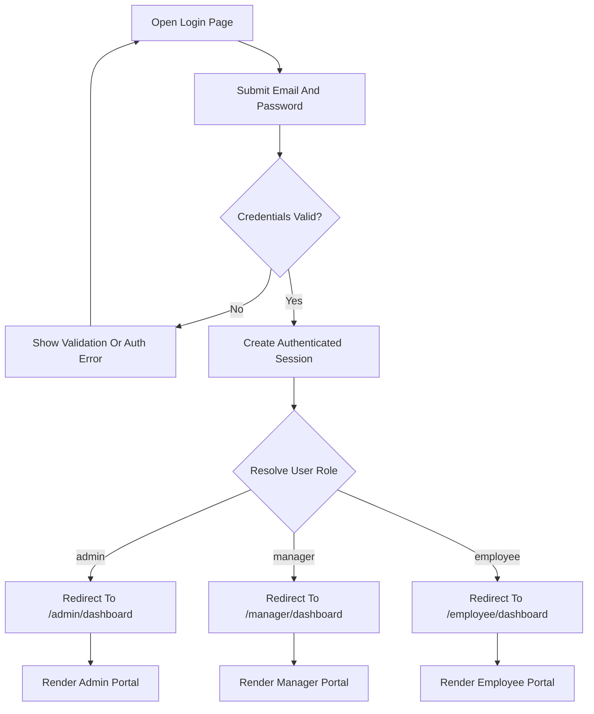

## 1. Product Overview
Build a clean role-based login system on Laravel 13 using Inertia.js, React 19, TypeScript, Tailwind CSS 4, PostgreSQL, Redis, and Laravel Sail.
- Main goal: provide secure authentication with Laravel Breeze and redirect authenticated users to dashboards based on role: `admin`, `manager`, or `employee`.
- Product value: offers a production-ready foundation for internal workforce platforms with clear MVC separation, fast local setup, and immediate seeded test access.

## 2. Core Features

### 2.1 User Roles
| Role | Registration Method | Core Permissions |
|------|---------------------|------------------|
| Admin | Seeded account / database record | Access admin dashboard |
| Manager | Seeded account / database record | Access manager dashboard |
| Employee | Seeded account / database record | Access employee dashboard |

### 2.2 Feature Module
1. **Authentication**: login form, validation, session-based auth, remember-me support via Breeze defaults.
2. **Role-Based Redirection**: post-login routing based on `role`.
3. **Dashboards**: three distinct protected dashboards for admin, manager, and employee.
4. **Database Bootstrapping**: PostgreSQL-backed user records with seeded demo accounts.
5. **Developer Setup**: Laravel Sail, PostgreSQL, Redis, Breeze React + TypeScript, Tailwind CSS 4 installation flow.

### 2.3 Page Details
| Page Name | Module Name | Feature Description |
|-----------|-------------|---------------------|
| Login | Auth form | Email, password, remember me, validation errors, loading state, clean modern layout |
| Admin Dashboard | Portal header | Protected page with admin-only identity and portal messaging |
| Manager Dashboard | Portal header | Protected page with manager-only identity and portal messaging |
| Employee Dashboard | Portal header | Protected page with employee-only identity and portal messaging |

## 3. Core Process
Visitors access the login page, submit credentials, and authenticate through Laravel’s session guard backed by Sanctum-enabled session handling. After successful login, the backend resolves the user’s role and redirects to the matching protected dashboard. Seeded accounts allow immediate testing in local development.

## 4. User Interface Design
### 4.1 Design Style
- Primary colors: deep slate, white, and indigo accents
- Secondary colors: soft zinc neutrals with subtle emerald and amber support tones for status and role distinction
- Button style: rounded, modern, medium shadow, clear hover and disabled states
- Typography: clean professional sans-serif hierarchy with strong page titles and restrained body text
- Layout style: desktop-first split-panel or centered auth card with soft gradients, concise copy, and polished spacing
- Icon style suggestions: minimal line icons, understated and enterprise-friendly

### 4.2 Page Design Overview
| Page Name | Module Name | UI Elements |
|-----------|-------------|-------------|
| Login | Authentication card | Brand heading, supportive subtitle, input fields, remember checkbox, password reset link if available, loading submit button |
| Admin Dashboard | Hero panel | Title, role badge, short descriptive summary, clean analytics-ready placeholder area |
| Manager Dashboard | Hero panel | Title, role badge, evaluation-oriented summary, clean content shell |
| Employee Dashboard | Hero panel | Title, role badge, learning-oriented summary, clean content shell |

### 4.3 Responsiveness
Desktop-first layout with mobile adaptation through stacked panels, full-width form controls, and preserved spacing rhythm on tablet and phone breakpoints.
