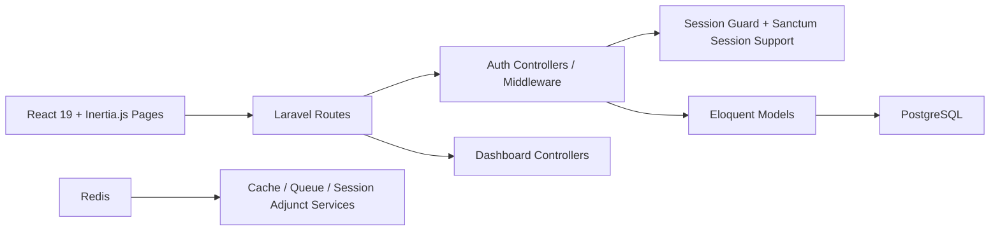
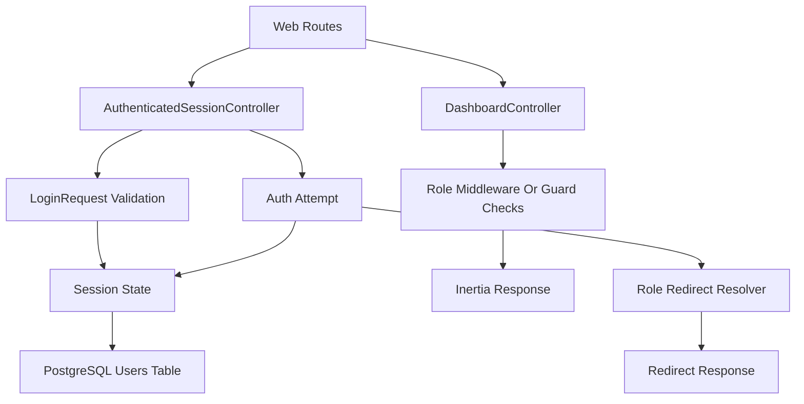
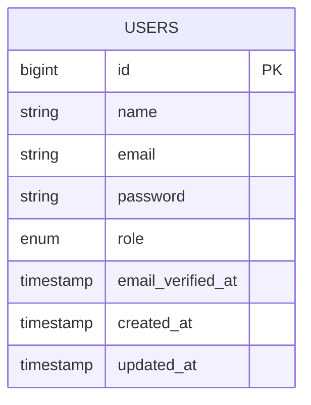

## 1. Architecture Design


## 2. Technology Description
- Framework: Laravel 13 on PHP 8+
- Frontend: React 19 + TypeScript + Inertia.js
- UI: Tailwind CSS 4
- Auth Scaffolding: Laravel Breeze with React and TypeScript stack
- Container Runtime: Laravel Sail
- Database: PostgreSQL
- Supporting Service: Redis
- Authentication Model: Laravel session authentication with Sanctum-enabled stateful session handling

## 3. Route Definitions
| Route | Purpose |
|-------|---------|
| `/login` | Display login page and submit credentials |
| `/dashboard` | Central post-login route that resolves user role and redirects |
| `/admin/dashboard` | Render admin dashboard for authenticated admin users |
| `/manager/dashboard` | Render manager dashboard for authenticated manager users |
| `/employee/dashboard` | Render employee dashboard for authenticated employee users |

## 4. API Definitions
The application is primarily page-driven through Inertia responses, but the authentication contract is still important for frontend typing and backend validation.

```ts
export type UserRole = 'admin' | 'manager' | 'employee';

export interface AuthUser {
  id: number;
  name: string;
  email: string;
  role: UserRole;
  email_verified_at: string | null;
}

export interface LoginRequest {
  email: string;
  password: string;
  remember: boolean;
}

export interface LoginValidationErrors {
  email?: string;
  password?: string;
}
```

## 5. Server Architecture Diagram


## 6. Data Model
### 6.1 Data Model Definition


### 6.2 Data Definition Language
```sql
CREATE TABLE users (
    id BIGSERIAL PRIMARY KEY,
    name VARCHAR(255) NOT NULL,
    email VARCHAR(255) NOT NULL UNIQUE,
    email_verified_at TIMESTAMP NULL,
    password VARCHAR(255) NOT NULL,
    role VARCHAR(20) NOT NULL DEFAULT 'employee',
    created_at TIMESTAMP NULL,
    updated_at TIMESTAMP NULL,
    CONSTRAINT users_role_check CHECK (role IN ('employee', 'manager', 'admin'))
);

CREATE INDEX users_role_index ON users (role);

INSERT INTO users (name, email, password, role, created_at, updated_at) VALUES
('Admin User', 'admin@alibaton.com', 'hashed_password_here', 'admin', NOW(), NOW()),
('Manager User', 'manager@alibaton.com', 'hashed_password_here', 'manager', NOW(), NOW()),
('Employee User', 'employee@alibaton.com', 'hashed_password_here', 'employee', NOW(), NOW());
```

## 7. Implementation Plan
1. Initialize Laravel 13 project and install Sail with PostgreSQL and Redis.
2. Install Breeze with React, TypeScript, and Tailwind CSS stack.
3. Add a `role` field to the `users` migration and model typing.
4. Seed three role-specific demo accounts.
5. Override post-login redirection logic with role-aware redirects.
6. Add protected role dashboard routes and React page components.
7. Restyle the login page with a modern enterprise UI and button loading state.
8. Verify TypeScript, PHP, routing, and authentication flow.
